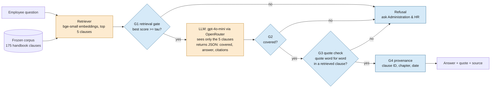

# AI Assistant for Company Policies

PE6201 Emerging AI Technologies · End-of-Course Project · Yichen Tang (Section A)

An employee asks an HR question in plain English. The assistant gives a short answer, quotes the
handbook clause it relied on, shows the document date, and refuses when the handbook does not
cover the question.

```
Q: How many days of marriage leave do I get?

You are entitled to 13 days of marriage leave after registering your marriage according to law.

  "An employee who registers a marriage according to law is entitled, under Jiangsu rules, to 13 days of marriage leave."
  — Haida Co. Employee Handbook, October 2026 revision — Chapter 7 — Leave, clause D07-5.1
```

(Real output from the evaluation run, question A01.)

**Results on 36 frozen test questions:** accuracy on answerable questions **16/24** (Ctrl-F search: 11/24);
refusal rate on unanswerable questions **12/12** (Ctrl-F: 6/12); about **$0.00008 per question**.

| Section | Where |
|---|---|
| Product: persona, input, output, architecture, metrics | [below](#1-product) |
| How to run it | [below](#2-run-it) |
| Data explainer | [`data/README.md`](data/README.md) |
| Evaluation explainer | [`eval/README.md`](eval/README.md) |
| Results and where it fails | [below](#5-results) and [`results/summary.md`](results/summary.md) |
| Code map | [below](#6-code-map) |

## 1. Product

### Persona

**Primary user: an employee of Haida Co.**, a small manufacturing company. They have a question
about leave, pay, attendance or discipline at the moment it matters ("my father just passed away",
"I was late twice this month"). They do not know which chapter covers it, they use everyday words
rather than the handbook's wording, and today they either search a long document or ask the
Administration & HR Department.

**Secondary: the Administration & HR Department**, which answers the same questions repeatedly and
needs answers that point to the exact rule.

### Input and output

| | |
|---|---|
| **Input** | One question in plain English, as typed by the employee |
| **Output, when the handbook covers it** | An answer of at most 60 words, the verbatim sentence it relies on, and the clause ID, chapter and document date |
| **Output, otherwise** | A fixed refusal: "I can't answer that from the Employee Handbook. Please ask the Administration & HR Department." |
| **Interface** | A web page: a question box, the answer with its quoted clause, and a folded panel showing the retrieved clauses and which guard decided. Also a command-line script. |

### Architecture



Orange boxes use external intelligence: an open embedding model run locally, and a rented LLM.
Blue boxes are my own code. Every safety decision (G1, G3, the refusal text, the provenance line)
is plain code; the model only words the answer and picks the quote. The G1 threshold `tau` is set
on a separate development set. Evaluation runs the same pipeline over `eval/questions.jsonl` and
runs a Ctrl-F keyword baseline on the same questions.

This is retrieval-augmented generation, not an agent: the task is one lookup with no tools and no
multi-step plan.

### Metrics: targeted and reached

| Metric | Target, and where it was set | Reached |
|---|---|---|
| Answers that are correct and supported by a cited clause | ≥ 85% (problem statement) | **16 of 17 answers given (94%)** |
| Accuracy on answerable questions | Beat a Ctrl-F search of the handbook (instructor feedback) | **16/24 (67%)** vs Ctrl-F 11/24 (46%) |
| Refusal rate on unanswerable questions | Refuse when the handbook does not cover the question (problem statement) | **12/12 (100%)** vs Ctrl-F 6/12 (50%) |
| Questions about a specific person's data | Always refuse | **3/3 refused** (Ctrl-F answered all 3) |
| Cost per question | Report it (Class 5) | **$0.00008** on average, $0.00014 per question that reaches the model |

The problem statement set 85% as one number over all questions. Split as the instructor asked, the
assistant meets it on the answers it gives (94%), but counting every question, it handled 28 of 36
correctly (16 right answers plus 12 right refusals, 78%). The gap is seven answerable questions it
refused. See [Results](#5-results).

## 2. Run it

**Colab (recommended).** [Open the notebook in Colab](https://colab.research.google.com/github/TyyCheN/pe6201-policy-assistant/blob/main/notebooks/PE6201_Project_Policy_Assistant.ipynb),
save an [OpenRouter](https://openrouter.ai) API key as a Colab Secret named `OPENROUTER_API_KEY` (or paste it when asked), and run all cells.
The notebook clones this repository, checks the corpus freeze, runs the Ctrl-F baseline, the assistant and
the full evaluation, and writes the files in `results/`. Its last section opens the web page inside the notebook.
A full run takes a few minutes and costs under one cent.

**Local.**

```bash
pip install -r requirements.txt
export OPENROUTER_API_KEY=sk-or-...
python scripts/run_eval.py --judge        # full evaluation -> results/summary.md
python scripts/ask.py "Who approves a half-day leave request?"
pip install gradio && python scripts/app.py   # web page at http://127.0.0.1:7860
```

**No API key, no model download.**

```bash
python scripts/run_eval.py --baseline-only   # the Ctrl-F baseline, a real result
python scripts/run_eval.py --fake            # smoke test of the whole pipeline with a fake model
python -m pytest tests -q                    # offline tests (pip install pytest)
```

## 3. Data

One document: the Haida Co. Employee Handbook, October 2026 revision. It is the real handbook of a
small manufacturing company in Jiangsu, China (my family's business), translated from Chinese into
English and redacted (company name, city names, product line). 12 files, 175 numbered clauses, about
9,800 words, no personal data. One clause is one retrieval unit. The corpus was committed and hashed
before any question was written.

Details, file list, preparation steps and how to verify the freeze: [`data/README.md`](data/README.md).

## 4. Evaluation

36 test questions written after the freeze: 24 answerable (direct, paraphrase, number, multi-part,
edge case) and 12 unanswerable (6 plausible HR questions the handbook does not cover, 3 out of domain,
3 asking for a person's data). Two scores, reported separately with counts: accuracy on answerable
questions and refusal rate on unanswerable questions. Answers are checked by code (L1, the headline),
by a model judge (L2) and by hand. A Ctrl-F keyword search runs on the same questions as the baseline.

Question format, scoring rules, the development set and the output files: [`eval/README.md`](eval/README.md).

## 5. Results

One run with `openai/gpt-4o-mini`, `bge-small-en-v1.5` embeddings, k = 5 and `tau = 0.684` from the
development set. Full report: [`results/summary.md`](results/summary.md); every question:
[`results/assistant.csv`](results/assistant.csv). An earlier run with the same model, corpus and questions gave the
same outcome on all 36 questions (same answers right, same refusals, same citations); only the wording of six answers differed.

| | Assistant | Ctrl-F |
|---|---|---|
| Accuracy on answerable questions | **16/24 (67%)** | 11/24 (46%) |
| Refusal rate on unanswerable questions | **12/12 (100%)** | 6/12 (50%) |
| Correct when it gives an answer | **16/17 (94%)** | 11/26 (42%) |
| Answerable: wrongly refused | 7 | 4 |
| Answerable: answered but wrong | 1 | 9 |
| Unanswerable: answered anyway | 0 | 6 |

By question type, the gain over Ctrl-F is on paraphrases (3/6 vs 0/6), direct questions (4/5 vs 1/5)
and personal-data questions (3/3 refused vs 0/3). Retrieval found a gold clause in the top 5 for 23 of 24
answerable questions.

**Where it fails.** The assistant errs on the side of refusing.

- **G1 refused five answerable questions** (A02, A14, A22, A23, A24). For four of them the right clause
  had been retrieved, but the top score (0.59 to 0.67) fell below `tau`. Unanswerable questions stopped
  by G1 scored up to 0.665, so on this test set no threshold separates the two groups cleanly. `tau` was
  set on six development questions and was not re-tuned on the test set.
- **G3 refused one correct answer (A09).** The logged reply shows the model answered correctly (300% pay
  for a public holiday) but "quoted" a shortened sentence that is not in the handbook; the clause says
  "not less than 150%, 200% and 300% respectively". G3 rejects any quote that is not word for word.
- **G2 refused one answerable question (A08).** The right clause was retrieved first, but the model did
  not map "a normal weekday evening" to "extended hours on a working day" and said the clauses did not cover it.
- **One wrong answer (A13).** Asked who approves a half-day leave, the model treated half a day as
  "no more than 2 hours" and named the direct supervisor. The handbook sets approval by hours (D07-1.2),
  so the right answer is the Administration & HR Department. The quote shown with the answer lets a
  reader catch this.
- **One retrieval miss (A24).** "AI chatbot" did not match "artificial intelligence services" in D03-4.2.

**Hand check.** I read all 17 answers against the handbook (`hand_label` in `results/assistant.csv`):
16 correct, 1 wrong (A13). The L1 checks agree with my labels on all 17. The L2 judge agrees on 15: it
never passed a wrong answer (precision 14/14) but failed two correct answers, A04 and A21, for extra or
missing detail (recall 14/16). The headline accuracy therefore uses L1, and the judge is a second opinion.

**Cost.** 20 model calls for 36 questions (a G1 refusal costs nothing): on average 368 input and 40
output tokens per question, $0.00008 per question, $0.0029 for the run, as billed by OpenRouter.
Judge calls are an evaluation cost and are counted separately (`judge_*` columns).

## 6. Code map

Every module starts with a docstring describing what it does.

| File | Responsibility |
|---|---|
| `src/policy_assistant/corpus.py` | Load the frozen corpus into `Clause` objects (ID, chapter, section, text, source, date) |
| `src/policy_assistant/retriever.py` | Embed clauses and questions (`bge-small-en-v1.5`), return the top k by cosine similarity; TF-IDF fallback |
| `src/policy_assistant/llm.py` | `OpenRouterLLM`, the rented model (JSON output, billed cost per call); `FakeLLM` for offline tests |
| `src/policy_assistant/assistant.py` | The pipeline and the four guards G1–G4; `format_answer` renders the reply |
| `src/policy_assistant/keyword_baseline.py` | The Ctrl-F baseline |
| `src/policy_assistant/evaluate.py` | Threshold calibration on the dev set, L1 and L2 scoring, CSV output, `summary.md` report |
| `scripts/run_eval.py` | Run the whole evaluation from the command line |
| `src/policy_assistant/ui.py` | The web page (Gradio): renders the answer, the quoted clause and the guard trace; no logic of its own |
| `scripts/ask.py` | Ask one question from the command line |
| `scripts/app.py` | Open the web page locally |
| `scripts/freeze_manifest.py` | Write or check `data/corpus/MANIFEST.json` |
| `notebooks/PE6201_Project_Policy_Assistant.ipynb` | End-to-end walk-through, used for the reported run |
| `tests/test_smoke.py` | Offline tests of the four guards, the corpus freeze, the question set and the web page rendering |

```
data/       corpus (D00..D11.md, MANIFEST.json) and its explainer
eval/       questions.jsonl (test), dev.jsonl (threshold only) and their explainer
src/        the assistant
scripts/    command-line entry points
notebooks/  the Colab notebook
results/    summary.md, assistant.csv, baseline.csv
tests/      offline tests
```

## 7. Limitations and responsible use

- The handbook is a revision that takes effect only on formal release (clause D10-2). The assistant shows the document date so a reader can tell which version an answer comes from.
- The corpus is a translation. In a dispute the Chinese original prevails, and the assistant is not legal advice.
- The handbook often defers to the law or to the employment contract ("according to law"). The assistant can only report what the handbook says.
- 36 questions written by one person is a small test set. The counts are reported so the uncertainty is visible.
- Questions go to a hosted model API. The prototype sends only handbook text and the question; a production version needs access control, an approved data location and a rule against employees typing personal data into the question.
- High-impact decisions (termination, pay disputes, medical leave) should go to the Administration & HR Department, which is also where every refusal points.
